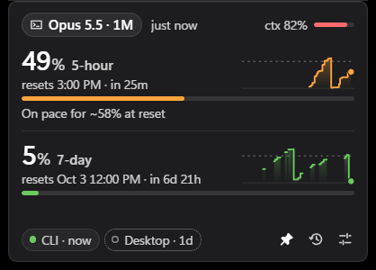
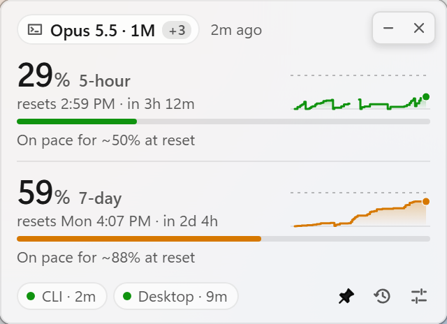
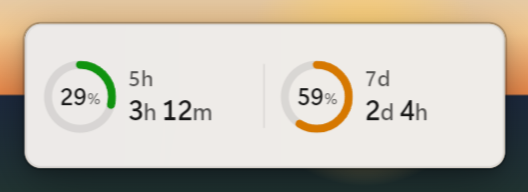
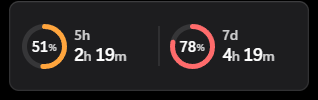
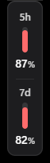
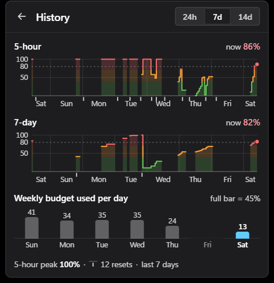
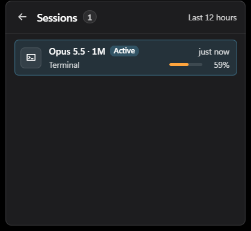
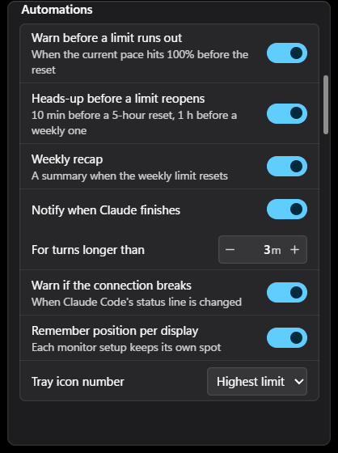
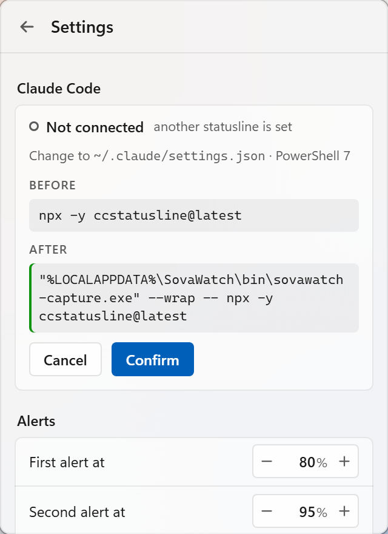

<div align="center">

# SovaWatch

**SovaWatch — usage widget for Claude Code & Claude Desktop.**
A small floating Windows widget that shows your Claude 5-hour and weekly usage, when each limit
resets, and the model and context of your current Claude Code session — without ever touching
your Claude login.

[**Download for Windows**](https://github.com/MarawanEldeib/sovawatch/releases/latest) ·
[Install guide](INSTALL.md) · [Privacy](PRIVACY.md)



</div>

---

## Why

Claude Pro and Max plans share a 5-hour and a weekly usage limit between Claude, Claude Desktop
and Claude Code. The numbers live in a settings page or in Claude Code's status line — which is
only visible while a terminal is open. This widget keeps them on screen next to whatever you are
doing: coding, watching a course, reading docs, or working in Claude Desktop.

## Features

**At a glance**
- 5-hour and weekly usage with live reset countdowns (exact from Claude Code, estimated with "~"
  from Claude Desktop)
- Current model and context-window % of your active Claude Code, Desktop Code tab or Cowork session
  — with 1M-context detection
- Burn-rate forecast: *"On pace for ~72% at reset"* or *"100% at 15:40"*
- Sparklines, a 14-day **History** view with reset marks, and weekly budget used per day
- **Sessions** view listing every session from the last 12 hours
- A "▲" marker when Claude has worked since a reading, so an older number never looks final

**Stays out of your way**
- Floating, pin-on-top window with a compact **pill** view, or tucked into a screen **edge dock**
- **Click-through ghost mode** (Ctrl+Alt+U) and a **show / hide** shortcut (Ctrl+Alt+H)
- Hides automatically while a fullscreen video, course or app is in front
- Hover the top edge for minimize / close; right-click for a menu; lives in the tray with the live
  % drawn in its icon
- Remembers its position per monitor setup; accent colours, rings or bars, four UI sizes

**Notifications**
- Limits at 80% / 95%, and when a limit resets
- **Pace alert** — warned *before* you run out, plus a heads-up shortly before a capped limit
  reopens (10 minutes for the 5-hour limit, 1 hour for the weekly one)
- **Claude finished** — when a long Claude Code turn completes while you are elsewhere
- Context-window alerts ("Opus 5.5 at 90% context — consider /compact")
- A **weekly recap** when the weekly limit resets
- A warning if something rewrites your Claude Code status line, with one-click Reconnect

Every notification can be switched off in **Settings** (under Alerts, Context alerts or
Automations).

## Screenshots

| Card | Pill | Edge dock |
|:---:|:---:|:---:|
|  | <br><br> |  |

| History | Sessions | Settings → Automations |
|:---:|:---:|:---:|
|  |  |  |

## Install

1. Download `SovaWatch_x.y.z_x64-setup.exe` from the
   [latest release](https://github.com/MarawanEldeib/sovawatch/releases/latest).
2. Run it. No admin rights needed — it installs for your user only.
   The installer is not code-signed yet, so Windows may say *"Windows protected your PC"*:
   click **More info → Run anyway**.
3. The widget appears in the bottom-right corner of your screen and in the tray. It already works
   from Claude Desktop's own usage data.
4. For exact, live numbers, open **Settings → Claude Code → Connect**
   (see [Connect Claude Code](#connect-claude-code)).

Checksum verification, updating, uninstalling and troubleshooting: [INSTALL.md](INSTALL.md).
SovaWatch was called Claude Usage Widget before; to move over, see
[Moving from Claude Usage Widget](INSTALL.md#moving-from-claude-usage-widget).

## Privacy — token-free by design

The widget **never** reads your Claude login (`~/.claude/.credentials.json`), cookies, browser
storage or keychains, and **never** calls Anthropic's servers or claude.ai. It makes **no network
requests at all** unless you turn on the update check, which only asks `api.github.com` whether a
newer release exists.

Everything it shows is computed from files already on your computer:

| Source | What it gives |
|---|---|
| Claude Code's status-line data (after **Connect**) | exact 5-hour / weekly %, exact reset times, model, context % |
| Claude Desktop's usage file (`%APPDATA%\Claude\plan-usage-history.json`) | 5-hour / weekly % every ~15 minutes while Desktop runs |
| Claude Code / Cowork session files (`~/.claude/projects/**/*.jsonl`) | model, context size and turn timing — message text is never read |

Every file read goes through an allowlist that hard-blocks credential, cookie and browser-storage
files. Nothing is uploaded anywhere. [PRIVACY.md](PRIVACY.md) lists every file read and written.

> Claude Desktop *chat* conversations don't store their model or context size on disk, so for
> those the widget shows your most recent Claude Code / Cowork session instead.

## Connect Claude Code

Connecting makes the numbers exact and live. It is optional and fully reversible.



1. The widget shows you the exact change first.
2. It copies a tiny helper, `sovawatch-capture.exe`, into `%LOCALAPPDATA%\SovaWatch\bin\`.
3. It changes **only** `statusLine.command` in `~/.claude/settings.json` (or adds a `statusLine`
   entry if you have none) so Claude Code's status-line data passes through the helper first.
   Your own status line keeps working and looks exactly the same; a backup of the file is kept.
4. The helper saves a few whitelisted numbers (usage %, reset times, model, context) — no prompts,
   no credentials.
5. A self-test compares your status line's output before and after.

**Disconnect** (Settings or the tray menu) restores the original command byte-for-byte, and so
does uninstalling. Connect needs a plain-JSON `settings.json`; if yours has comments, it shows an
error and changes nothing.

<br clear="right">

## FAQ

**Does it work without Claude Code?** Yes — with Claude Desktop open it reads Desktop's usage file
(updated about every 15 minutes). Reset times are then estimated and marked "~".

**Why is a number grey?** It is older than your stale threshold (default 20 minutes), usually
because neither Claude Code nor Claude Desktop has run since. The age is shown next to it.

**Does it slow my PC down?** No. It idles at a fraction of a percent of one CPU core and about
25–45 MB of private memory.

**Can it show over fullscreen apps?** It hides by default while something fullscreen is in front.
Turn on click-through ghost mode (Ctrl+Alt+U) to keep it visible and see-through instead.

## For developers

<details>
<summary>Build, test and project layout</summary>

Requirements: Windows 10/11, Rust (see `rust-toolchain.toml`), Node 20+, Visual Studio Build Tools
(C++), WebView2 runtime.

```powershell
npm install
.\scripts\build-sidecar.ps1     # builds sovawatch-capture.exe into src-tauri\binaries\
npx tauri build                 # app + per-user NSIS installer (target\release\bundle\nsis\)
```

Checks: `cargo test --workspace`, `cargo clippy --workspace --all-targets -- -D warnings`,
`npm test`, `npm run check`, `node scripts/privacy-grep.mjs`.

The UI runs in a plain browser with a mock backend: `npm run dev`, then open
`http://localhost:1420/?scenario=normal&view=card` (views: `pill`, `card`, `settings`,
`sessions`, `history`).

Layout:
- `crates/core` — token-free parsers and the engine (merge, reset estimation, burn rate, context,
  history, alerts, recap, safe settings edits)
- `crates/capture` — `sovawatch-capture.exe`, the status-line helper
- `src-tauri` — the app: data pipeline, file watchers, window, tray, hotkeys, notifications,
  installer hooks
- `src` — Svelte 5 UI

Development overrides: `SOVA_DATA_DIR`, `CLAUDE_CONFIG_DIR`, `SOVA_X` / `SOVA_Y`,
`SOVA_MEMORY_NORMAL`, `SOVA_BROWSER_ARGS`.

</details>

## Credits

- **Idea:** Eng. Abdulrahman Alhelali — who came up with the idea of a live, always-visible view of
  Claude usage limits.
- **Design & development:** Eng. Marawan Eldeib — built and maintains the widget.

## Terms

Using the app means you accept the [Terms of Use](TERMS.md) (also shown by the installer).

## License

Copyright © 2026 Marawan Eldeib. **All rights reserved** — see [LICENSE](LICENSE).
You may install and use the official releases for personal use. Copying, modifying or
redistributing the code or the app is not permitted without written permission.

Independent project, not affiliated with or endorsed by Anthropic. Claude and Claude Code are
trademarks of Anthropic, PBC. Open-source components and their licenses:
[THIRD_PARTY_NOTICES.md](THIRD_PARTY_NOTICES.md).
